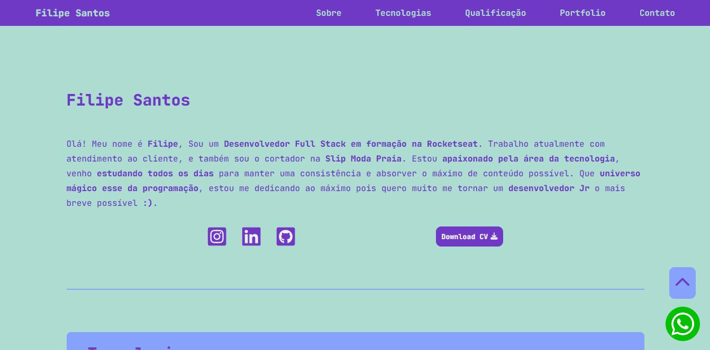

# Meu segundo portfolio 

> Sobre o portfolio

Esse é meu segundo portfolio, eu queria mudar o visual do primeiro, aí coloquei a barra de navegação do jeito tradicional lá em cima. Coloquei uma rolagem suave de navegação entre as sessões, pelo JavaScript. Selecionei uma paleta de cores que combinam entre si, gostei muito do resultado.

[🔗 Clique aqui para acessar](https://filipesantos07.github.io/portfolio02/)

## 🛠️ Tecnologias

- HTML
- CSS
- JavaScript

## 💛 Contato

FilipeSantosEstudos1@gmail.com
